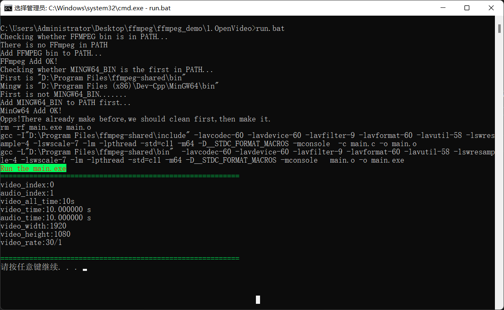

# FFmpeg64bit-Compile-script-And-Makefile-on-Windows

windows上配置和编译ffmpeg有点麻烦，写一个脚本方便运行

main.c和video.mp4可以用来测试脚本能不能用

## Makefile变量

### CC
编译器，我用的是gcc64位的，ffmpeg也要用64位。注意，要是有人用32位gcc，那ffmpeg也要用32位。

### IncludeDirFlag
表示include文件夹，就是头文件的位置,自己修改好自己对应的位置
一般在...\ffmpeg\include

### LinkDirFlag
动态连接库的位置，一般在...\ffmpeg\bin下，注意ffmpeg需要是shared版本
我脚本中用的是64位ffmpeg和64位的gcc，也可以改g++但是改g++的时候要注意修改FLAG中的-std=c11为-std=c++11

ffmpeg windows：根据自己的编译器选择。
64位下载： https://github.com/BtbN/FFmpeg-Builds/releases
32位下载：https://github.com/sudo-nautilus/FFmpeg-Builds-Win32/releases

### LinkFlag
表示连接那个dll文件，就是-L后面那个文件夹中的。

### FLAG
一些编译设置，可以自己选择

## run.bat
设置变量，或者修改一些东西的时候不要为了美观打空隔，不然有可能会错
比如
set FFMPEG_BIN=D:\Program Files\ffmpeg-shared\bin
改成
set FFMPEG_BIN = D:\Program Files\ffmpeg-shared\bin
就是错的，不可以！！！

### MINGW64_BIN
表示你的Mingw也就是gcc或者g++的位置，make也在这个位置
注意：你的`make`可能是`mingw32-make.exe`，最好在原来的位置复制一份，改名叫make.exe,不然的话就要把run.bat中的`make`改为`mingw32-make`

### FFMPEG_BIN
就是你动态连接库的位置，一般在...\ffmpeg\bin下
和Makefile中LinkDirFlag同一个位置。

## 使用方式
把Makefile和run.bat放在同一个文件夹下，把要编译的main.cpp也放在同一文件夹下
配置好后，直接运行run.bat就可以直接自动编译加运行，如果检查到之前编译过，run.bat会自动清除并，重新编译。运行时同样会自动检测环境中是否含有...\ffmpeg\bin，没有会自动加入。

## 其它注意事项：
run.bat最终运行的是main.exe要是想让他运行其它的就要修改main.exe为其它名字
Makefile中只是把main.cpp编译为main.exe,要是想要复杂功能的需要修改

## 运行效果
直接运行run.bat,run.bat自己会运行make来执行当前文件夹下的Makefile

绿色框框中就是运行输出。
